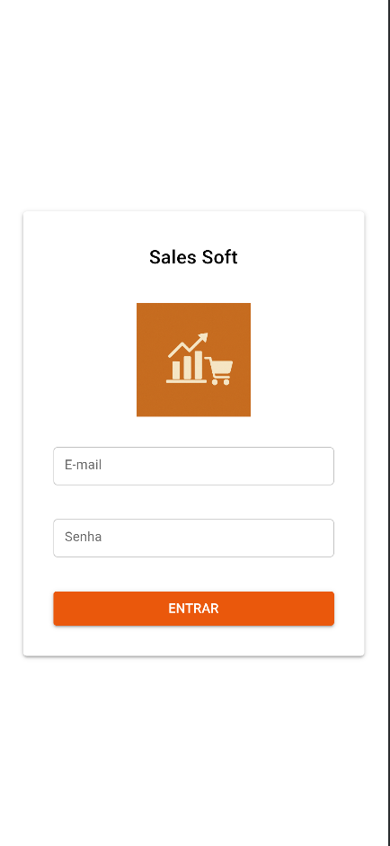
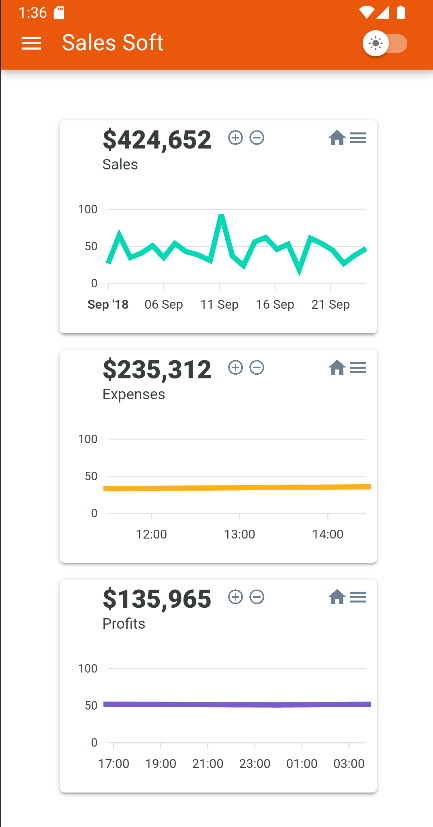
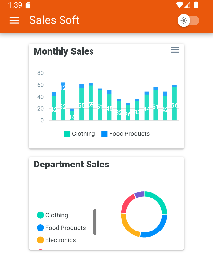
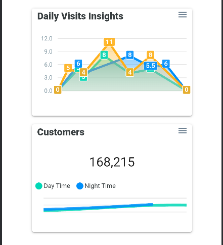
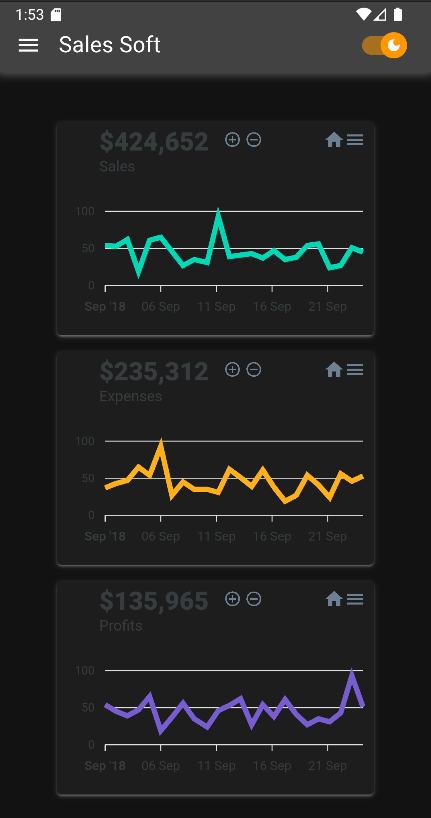

# 📱 Sales Soft

Sales Soft é um template inicial em desenvolvimento para criação de aplicativos mobile usando [Quasar Framework](https://quasar.dev/) com [Capacitor](https://capacitorjs.com/), ideal para projetos modernos e escaláveis.

Este projeto já conta com uma base sólida e boas práticas para apps que integram dados locais e remotos, gerenciamento de estado, internacionalização e uma UI responsiva com suporte a dark mode.

---

## 📸 Prints do projeto

Aqui estão algumas capturas de tela do projeto:

### Tela de Login



### Tela de Dashboard






---

## 🔧 Tecnologias utilizadas

- [Quasar Framework](https://quasar.dev/) + [Capacitor](https://capacitorjs.com/) – App mobile multiplataforma (Android/iOS)
- [Pinia](https://pinia.vuejs.org/) – Gerenciamento de estado reativo
- [Axios](https://axios-http.com/) – Requisições HTTP para usar em requisições externas tais como consulta de CNPJ, CEP, etc...
- [Vue I18n](https://vue-i18n.intlify.dev/) – Internacionalização (Só foi instalado ainda não foi aplicado)
- [SQLite](https://www.sqlite.org/index.html) – Armazenamento local de dados
- [Supabase](https://supabase.com/) – Para onde os dados serão sincronizados, um hub onde os sistemas host poderá usar a api para receber/enviar dados
- [Apexcharts](https://apexcharts.com/) – Modern & Interactive Open-source Charts

---

## ✅ Funcionalidades implementadas

- ✅ Layout publico e privado
- ✅ Criação e atualização automática das tabelas no SQLite com base em objetos modelo, composable para abstrair as operações no sqllite
- ✅ Autenticação (ainda não está usando o banco de dados)
- ✅ Integração com API do Supabase (Só foi feito a configuração, e um composable para abstrair o supabase)
- ✅ Suporte a modo escuro (_dark mode_)
- ✅ Tela de dashboard como exemplo inicial de layout

---

## ▶️ Como rodar o projeto

### Clone o repositório

```bash
git clone https://github.com/seu-usuario/sales-soft.git
cd sales-soft
```

### Install the dependencies

```bash
yarn
# or
npm install
```

### Start the app in development mode (hot-code reloading, error reporting, etc.)

```bash
quasar dev
```

### Lint the files

```bash
yarn lint
# or
npm run lint
```

### Format the files

```bash
yarn format
# or
npm run format
```

### Build the app for production

```bash
quasar build
```

### Build para mobile

```bash
quasar build -m capacitor -T android
```

### Customize the configuration

See [Configuring quasar.config.js](https://v2.quasar.dev/quasar-cli-vite/quasar-config-js).

## Mobile Android

Obs: certifique-se de ter o Android Studio instalado para builds Android.

Sete as variaveis:
PATH=$PATH:$ANDROID_SDK_ROOT/tools; PATH=$PATH:$ANDROID_SDK_ROOT/platform-tools

Leia a documentação:
https://quasar.dev/quasar-cli-vite/developing-capacitor-apps/introduction
